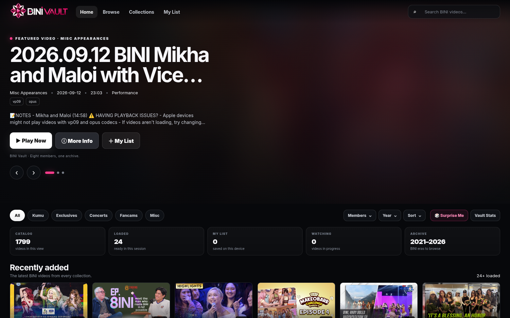
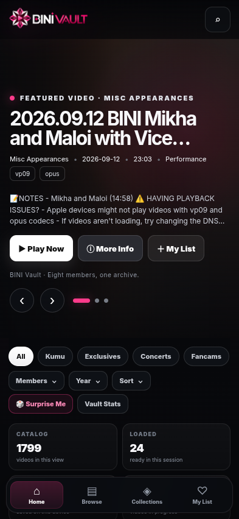

<div align="center">

# 🌸 BINI Vault

### Discover. Watch. Relive.

A modern BINI-focused media archive with a streaming-style experience built for fast discovery, easy browsing, and responsive playback.

**[🚀 Open the live BINI Vault](YOUR_DEPLOYED_URL_HERE)**

</div>

---

## 👀 See it first

### Desktop



### Mobile



> BINI Vault is already deployed. Most users only need the live URL above — no installation or deployment is required.

---

## ✨ What is BINI Vault?

BINI Vault brings BINI video content from its configured public catalogs into one polished archive.

Instead of searching through scattered links, users can:

- discover recently added videos
- browse collections
- filter by member and year
- search the archive
- save videos to My List
- continue watching where they left off
- discover older content through archive features

---

## 🎬 Highlights

| | |
| --- | --- |
| 🌸 **Cinematic Home** | Featured content with a subtle blurred BINI artwork background |
| 🔎 **Fast Discovery** | Search, collections, member filters, year filters, and sorting |
| ♾️ **Infinite Archive** | Content loads progressively as you scroll |
| ▶️ **Streaming-style Player** | YouTube and compatible direct-video playback |
| ❤️ **My List** | Save videos locally for later |
| ⏯️ **Continue Watching** | Keep local watch progress on the device |
| 🎲 **Surprise Me** | Randomized discovery for when you don't know what to watch |
| 📅 **On This Day** | Rediscover archive content from previous years |
| 📱 **Responsive** | Desktop, tablet, and mobile layouts |

---

## 📚 Collections

BINI Vault currently organizes content into collections such as:

**Kumu · Exclusives · Concerts · Fancams · Misc**

The archive can also be explored by:

**Members · OT8 · Year · Tags · Date**

---

## ⚡ Built for a large archive

The browser does not render the entire catalog at once.

```text
Public Google Sheets
        ↓
Fetch + Parse
        ↓
Server Cache
        ↓
API
        ↓
First batch
        ↓
Render
        ↓
User scrolls
        ↓
Next batch
        ↓
Append only
```

This keeps the initial page lightweight while allowing the archive to grow without loading thousands of cards into the DOM at startup.

---

## 📱 Responsive design

BINI Vault changes its layout based on available screen size instead of simply shrinking the desktop interface.

| Device | Navigation | Layout |
| --- | --- | --- |
| Desktop | Full top navigation | Multi-column grid |
| Tablet / iPad | Compact top navigation | Reduced columns and spacing |
| Phone | Top logo/search + bottom navigation | Two-column grid |
| Small phone | Compact mobile controls | Tighter hero and card spacing |

### Mobile reference


---

## 🧱 Architecture

```text
Google Sheets catalogs
        │
        ▼
    CSV parser
        │
        ▼
  Data normalizer
        │
        ▼
 Server-side cache
        │
        ▼
      REST API
        │
        ▼
   BINI Vault UI
     │      │
     │      └── Local watch state
     │
     └───────── Video player
```

The frontend is separated from the catalog parsing layer so the UI can evolve without changing the source format.

---

## 📚 Catalog format

The normalizer understands:

```text
title
chapter
duration
description
tags
uid
thumbnail
date
link
ORIGINAL
```

Playback prefers:

```text
link
```

and falls back to:

```text
ORIGINAL
```

when necessary.

---

## 🛠️ For developers

The live site is ready to use. Clone the repository only if you want to inspect, modify, or run BINI Vault locally.

### Requirements

- Node.js
- npm

### Run locally

```bash
git clone https://github.com/YOUR_USERNAME/bini-vault.git
cd bini-vault
npm install
npm start
```

Then open:

```text
http://localhost:3000
```

---

## 🗂️ Project structure

```text
bini-vault/
├── public/
│   ├── index.html
│   ├── app.js
│   └── assets/
├── src/
│   └── sheets.js
├── docs/
│   └── responsive/
├── server.js
├── package.json
├── package-lock.json
└── vercel.json
```

---

## 🎨 Design principles

**Image-led**  
The hero uses artwork as a blurred background layer instead of an aggressive foreground crop.

**Discovery-first**  
Search, collections, filters, sorting, and infinite scrolling make a large archive easier to explore.

**Responsive by default**  
Desktop, tablet, and phone use different navigation patterns where appropriate.

**Progressive loading**  
Content is fetched and appended in small batches instead of rendering the whole archive at once.

---

## 🔐 Data & storage

The current release does not require:

- user accounts
- authentication
- PostgreSQL / MySQL / MongoDB
- a dedicated application database

Personal features such as My List and watch progress are stored locally in the browser.

Catalog data is sourced from the project's configured public Google Sheets.

BINI Vault does not itself host the catalog's original video media; it provides the archive, discovery, and playback interface around the configured sources.

---

<div align="center">

### 🌸 BINI Vault

**Eight members. One archive.**

</div>
